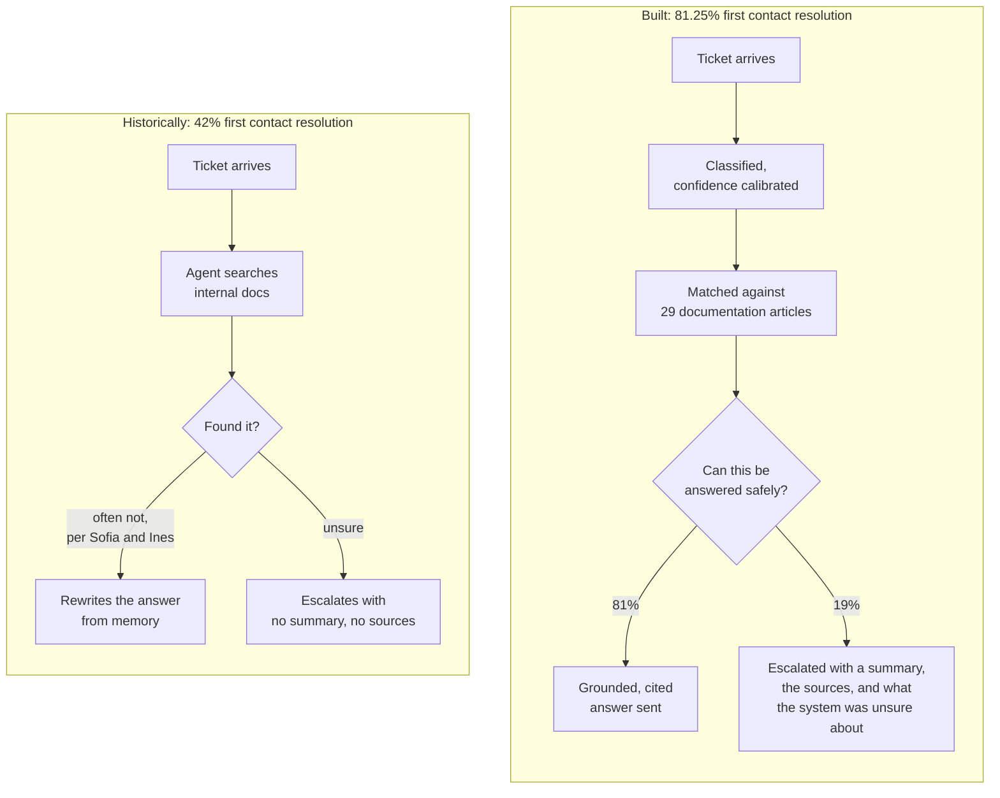
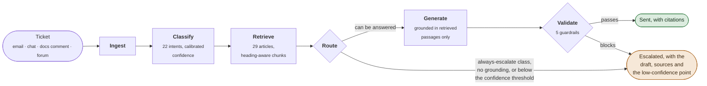

<div align="center">

# CloudServe Support Automation

**CloudServe asked for a chatbot. The discovery evidence said that was not the fix.**

Seven in ten tickets are already answerable from CloudServe's own documentation.
The problem is not what the docs contain, it's that agents cannot find it fast
enough and escalations arrive with no summary and no sources attached. This
system grounds every answer in the real documentation, attaches a calibrated
confidence score, and escalates the rest with the draft, the sources, and its
own stated uncertainty, rather than a bare forwarded ticket.

<br>


<sub>Dhanush Varanasi · Forward Deployed AI Engineering capstone · September 2026</sub>

</div>

---

## The problem, in one picture

CloudServe's support agreement promises a first reply within two hours; the
historical average is far past that, and under half of tickets resolve
without being passed to somebody else. Discovery (`docs/PRD.md` §2, five
stakeholder interviews plus the 500-ticket dataset) found the cause was not
missing documentation.



<sub>Achieved figures are from the clean 80-ticket validation run (no provider
fallbacks); see [What it achieved](#what-it-achieved) for why that qualifier
matters and what is still open at full development-set scale.</sub>

---

## What the stakeholders said, checked against the data

Every discovery claim below was tested against `development_tickets.json`
(n=500) rather than accepted on account of whose story was more convincing.

| Who said what | What the data showed |
| --- | --- |
| Ines (technical writer): *"internally, I do not think the support team uses \[the docs\] at all... customers do not describe problems in the words I used for the title."* | Confirmed as the real mechanism. 71.4% of tickets are answerable from the existing 29 articles; the gap is retrieval, not content. |
| Sofia (Tier 1): *"the documentation is fine, I cannot find things in it."* | Consistent with the above. Fixed by grounded retrieval over the same corpus, not by writing new articles. |
| Daniel (Tier 2): *"a good number \[of escalations\] were answered by pasting a link and two sentences. That is not a tier two problem."* | Confirmed. 49% (138 of 281) of historically escalated tickets were themselves answerable from the docs. |
| Daniel: *"if an escalation said here is what I think it is, here is the documentation that seemed relevant, and here is what I was not confident about, I would be twice as fast."* | Built directly: every escalation now carries the draft, the retrieved sources, and the specific low-confidence point (`escalation_summary`). |
| Sofia flagged non-fluent-English tickets as a fairness risk from experience. | Not confirmed on the data available. Non-fluent tickets resolved at 28.33% against 27.37% for fluent (500-ticket run) and 84.21% against 80.33% (clean 80-ticket run), both times slightly *better*, not worse. Treated as provisional, not closed, since neither run is large *and* clean at once. |

---

## What looked settled, and then was not

The fairness audit's most interesting result was not a finding, it was a
finding that reopened itself. The 500-ticket run (contaminated by a
provider quota problem, see below) showed customer-tier resolution rates
within 3.4 points of each other, comfortably inside the 5-point fairness
threshold. A second, genuinely clean run at validation scale told a
different story:

| Run | Standard | Business | Enterprise | Spread |
| --- | ---: | ---: | ---: | ---: |
| 500 tickets, quota-contaminated | 26.48% | 29.88% | 26.51% | 3.40 pts (met) |
| 80 tickets, clean | 71.43% | 93.33% | 87.50% | 21.9 pts (missed) |

The clean run is the more trustworthy one and the smaller one, so this is
recorded as reopened rather than resolved either way. Settling it needs a
full clean run at development-set scale, split across two calendar days
to stay inside the provider's daily quota, not yet done as of this
submission.

---

## What it does

Six components in sequence. Routing decides whether a ticket may reach the
language model at all; validation checks what comes back before it can be
sent. Generation is only ever allowed to phrase an answer already grounded
in retrieved passages, never to decide who sees what.



Every stage writes to the SQLite decision log, whatever the outcome, so a
routing decision can be read back without opening code.

| Component | Responsibility | Code |
| --- | --- | --- |
| Ingest | Normalise all four channels into one shape, keep the original text | `src/ingest/ingest.py` |
| Classify | Intent (22 classes), urgency, calibrated confidence with alternatives | `src/classify/classifier.py` |
| Retrieve | Ranked, identifiable passages from the 29-article corpus, or nothing | `src/retrieve/retriever.py` |
| Route | Deterministic auto-respond vs. escalate, logged with a human-readable reason | `src/route/router.py` |
| Generate | Answer grounded only in retrieved passages, or an explicit decline | `src/generate/generator.py` |
| Validate | Five blocking guardrails, checked before every release | `src/validate/guardrails.py` |

---

## How it decides

Checks run in a fixed order and the first match wins. Policy comes before
confidence: some ticket classes are never automated regardless of how sure
the model is.

| Rule | Fires when | Outcome |
| --- | --- | :-- |
| Fallback used | The model call failed and a fallback classification was substituted | Escalate |
| Always-escalate class | `security_incident`, `compliance_request`, `feature_request`, `unclear_request` | Escalate |
| No grounding | Nothing retrieved cleared the relevance floor | Escalate |
| Below confidence threshold | Confidence under `CONFIDENCE_THRESHOLD` (0.80, unmeasured placeholder, see below) | Escalate |
| Everything above passed | | **Answer, with citations** |
| Guardrail blocked | Grounding, private data, injection, tone/scope or confidence-floor check failed | Escalate |

**87 of 500 development tickets carry an always-escalate class**, and the
system has answered exactly zero of them across every run to date.

The 0.80 threshold is the build pack's own illustrative number, not one
measured from this system's calibration data; `evaluation/harness.py`'s
calibration table is what should justify moving it, and hasn't been acted
on yet, see `docs/architecture.md` §4.

---

## Guardrails

All five run on every generated response, not only in testing.
`test_guardrail_block_downgrades_auto_respond_to_escalate` proves a
guardrail hit downgrades the final action rather than only logging a
warning.

| Guardrail | Checks | On trigger |
| --- | --- | --- |
| `private_data` | Email addresses, card- and phone-like digit runs, API-key-shaped tokens | Block, escalate |
| `grounding` | Every citation resolves to a passage actually retrieved | Block, escalate, unsupported claim flagged |
| `instruction_integrity` | Ticket text read as an instruction to the system | Block, escalate, recorded for review |
| `tone_and_scope` | Response for refund, commitment or deadline language outside support scope | Block |
| `confidence_floor` | A confidence score actually exists, not a fallback or missing value | Escalate |

Across both real evaluation runs, not one response was blocked: routing
diverts the risky classes before generation is reached, so nothing unsafe
has yet reached the guardrails on real traffic. Their behaviour under an
actual bad response is what the unit tests exercise directly.

---

## What it achieved

Measured across two real, unattended runs: 500 development tickets on
2026-09-16, and a clean rerun of the 80-ticket validation set on
2026-09-17 once the provider's daily quota had reset. The 500-ticket run
is reported for scale; figures marked *clean* are the more trustworthy
ones and are called out as such.

| Measure | Baseline | Target | 500 tickets | 80 tickets, clean | |
| --- | ---: | ---: | ---: | ---: | :--- |
| First contact resolution | 42% | 60%+ | 27.6%* | **81.25%** | **met, clean** |
| Escalation rate | 58% | ≤ 30% | 72.4%* | **18.75%** | **met, clean** |
| Classification accuracy, 0.8-1.0 confidence band | N/A | 85%+ | 90.4% | 91% | **met** |
| Retrieval hit rate | N/A | N/A | 94.4% | 96.23% | consistent both runs |
| Latency, p95 | N/A | < 3s | 10.35s | 10.64s | **missed, both** |
| Private data in outbound text | N/A | 0 | 0 | 0 | **met** |
| Never-auto-respond breaches | N/A | 0 | 0 of 87 | 0 of 87 | **met** |
| Decision log reconciliation | N/A | exact | exact | exact | **met** |
| Cross-group variation, language fluency | N/A | < 5 pts | 0.96 pts | 3.88 pts | **met** |
| Cross-group variation, customer tier | N/A | < 5 pts | 3.40 pts* | 21.9 pts | **reopened**, see above |

<sub>* The 500-ticket run had 161 of 500 tickets (32.2%) fall back to forced
escalation because Groq's free-tier daily token quota was exhausted
partway through. That depresses FCR and escalation-rate figures for that
run uniformly, which is why the clean 80-ticket numbers, not these, are
the headline result. Full detail and reasoning: `docs/PRD_REVISION_LOG.md`.</sub>

**Latency misses its target both times, for a reason that has nothing to
do with the quota problem.** Splitting the clean run's own latencies by
final action: escalated tickets (one classify call) had a 0.80s median;
auto-responded tickets (which also call the generator) had a 7.52s median
and an 11.16s max. The generation call's own inference time on the free
tier is the dominant driver, not retry backoff, confirmed on a run with
zero retries.

---

## The headline technical finding

The two evaluation runs on 2026-09-16 were not a clean read of the system,
they were dominated by two provider-side failures on the same day, and
both are the strongest evidence in this project that the reliability
requirement (NFR-02, graceful degradation) was not just a checkbox.

```mermaid
flowchart LR
    A["2026-09-16 morning<br/>500-ticket run starts"] --> B["Groq had retired both<br/>configured model IDs<br/>on 2026-08-16"]
    B --> C["Every call failed;<br/>fallback classification<br/>+ forced escalation"]
    C --> D["Traced to Groq's own<br/>deprecation page,<br/>model IDs fixed"]
    D --> E["Rerun: 161 of 500 tickets<br/>(32.2%) fall back anyway,<br/>daily token quota exhausted<br/>partway through"]
    E --> F["80-ticket rerun an hour later<br/>starts with under 1%<br/>of the day's quota left:<br/>90% fall back"]
    F --> G["2026-09-17: quota reset,<br/>clean 80-ticket rerun,<br/>zero fallbacks"]

    style B fill:#f7e2de,stroke:#a33526,color:#3d1a14
    style E fill:#f7e2de,stroke:#a33526,color:#3d1a14
    style G fill:#dcecdf,stroke:#2f7a41,color:#14301c
```



The fallback path (`UnavailableChatClient`, retry/backoff via `tenacity`)
kept the pipeline from crashing through both failures; it just meant two
of the three runs measured provider availability more than model quality.
Practical takeaway, recorded in the PRD revision: split any run above
roughly 100-150 tickets across two calendar days, or run a small canary
first to check the day's remaining quota.

---

## Running it

Requires Python 3.10+ and a free [Groq](https://console.groq.com) API key.

```bash
git clone https://github.com/dhanushvaranasi-alpha/cloudserve-agent.git
cd cloudserve-support

python3 -m venv .venv && source .venv/bin/activate   # Windows: .venv\Scripts\activate
pip install -r requirements.txt

cp .env.example .env
# edit .env and set GROQ_API_KEY=<your key>
```

The first run downloads the `all-MiniLM-L6-v2` embedding model (about
90MB, one time, cached afterward) and indexes the 29 documentation
articles into a local Chroma store, so a network connection is needed
once even though retrieval runs locally after that.

**Start the API and the demo UI:**

```bash
uvicorn src.api.main:app --reload --port 8000
```

Open `http://localhost:8000/` for a chat-style demo page with tabs for
classification, retrieval, routing, generation, guardrails and the
decision log. This is a video aid, not the Tier-2 review UI the PRD
explicitly cuts from v1 (`docs/PRD.md` §6).

**Run the full evaluation set, unattended:**

```bash
python -m evaluation.harness --input data/validation_tickets.json --output evaluation/results/
```

Takes an input path and an output path, never a hardcoded filename, since
this is the exact command run against a hidden ticket set the system has
never seen.

**Run the tests:**

```bash
python -m pytest tests/ -v
```

All 53 tests run with no network access and no API key: every component
that calls an external service has a fake counterpart (`FakeChatClient`,
`FakeRetriever`) used throughout `tests/`.

---

## Two branches, one system

`master` is the original plain-Python implementation: six functions
called in sequence, no orchestration framework. `langchain-langgraph-migration`
is the branch used for all demos, screenshots and the video going
forward: `src/pipeline.py` is rewritten as a `langgraph.graph.StateGraph`,
model calls go through `langchain_groq.ChatGroq`, and retrieval goes
through `langchain_chroma`/`langchain_huggingface`. Every public
interface, the `ChatClient` protocol, the retriever's methods, every
component function's signature, is identical between the two, and all 53
tests pass unchanged on both. The reasoning for building both, and why
the LangGraph branch is the one demoed, is in `docs/architecture.md` §6.

Optional LangSmith tracing is available on the LangGraph branch, three
extra lines in `.env`, off by default, purely for debugging and demoing;
`docs/architecture.md` §7 covers it.

---

## Design decisions worth knowing before reading the code

- **Dependency pins were updated** from the pack's template, which pins
  releases (`chromadb==0.3.21`, `langchain==0.1.0`) that no longer
  install. Current stable versions are used instead, still entirely
  free and open source.
- **The confidence threshold (0.80) is unmeasured.** It is the pack's own
  illustrative number, carried forward because the calibration data
  needed to justify moving it exists (`evaluation/harness.py`'s
  calibration table) but has not yet been acted on.
- **Groq was chosen for a free tier and fast inference**, relevant to the
  p95-latency target; it is also the source of both provider incidents
  above. The pipeline's prompts and control flow are provider-agnostic,
  so switching later is a config change, not a redesign.

## Known limitations

See `docs/PRD.md` §6 for the full list. Generation is English-only even
for non-fluent-English tickets in v1, a named and actively tested
fairness risk, not a silent gap. There is no dedicated Tier-2 review UI,
only the API and the decision log; the demo page at `GET /` is a video
aid built afterward, not that cut feature. The documentation corpus is
treated as a fixed snapshot with no staleness detection.

## AI tool use declaration

Full declaration in the capstone report. In short: Claude (Anthropic) was
used throughout for code implementation, test writing, and drafting
reference documents, under continuous review and correction. The
discovery findings, the problem statement, the evaluation interpretation
and the reflection are the author's own.
