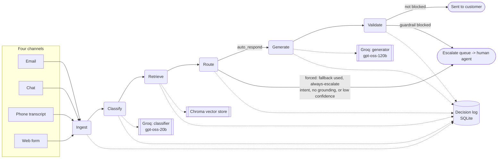
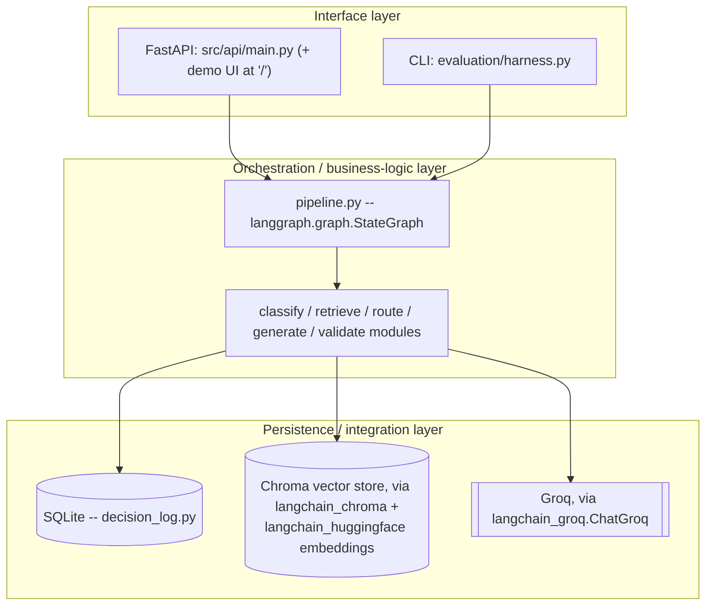
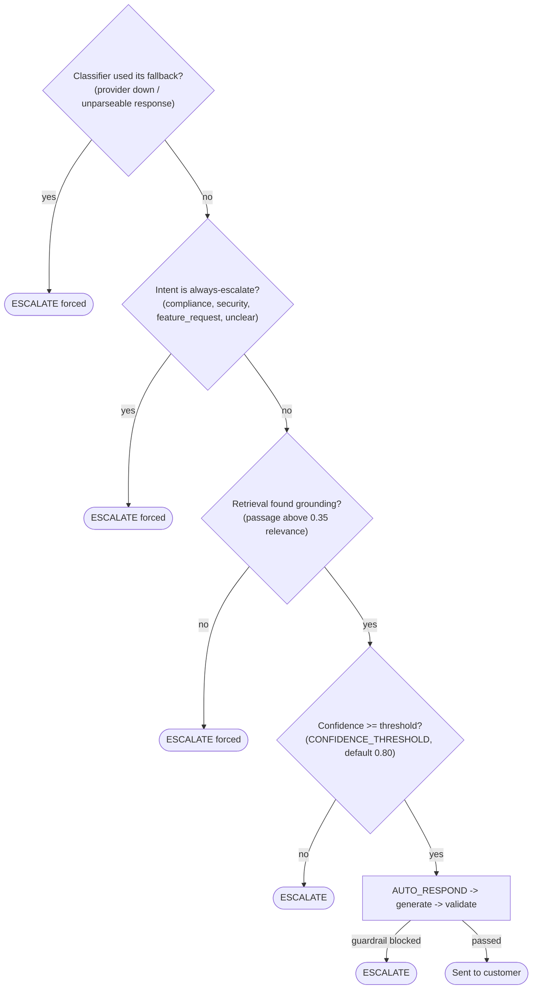

# Architecture: CloudServe support automation system

**This document describes the `langchain-langgraph-migration` branch**, the
project's demo branch going forward (all live runs, the demo UI, screenshots
and the video are from this branch). `master` keeps the original plain-Python
implementation as the baseline the "Stack decisions" section (§6) compares
against; the two branches implement identical requirements behind identical
public interfaces, so everything in §1 and §5 (components, routing logic,
FR/NFR mapping) applies to both. Only the orchestration, LLM-client and
retrieval internals described in §6 differ.

## 1. High-level view: six components, three cross-cutting concerns

```
                    ┌─────────────────────────────────────────────┐
                    │        Cross-cutting concerns                │
                    │  1. Decision logging & auditability          │
                    │  2. Guardrails & safety                      │
                    │  3. Reliability & observability (retry, lat.,│
                    │     LangSmith trace) -- see §6, §7            │
                    └─────────────────────────────────────────────┘
                                        │  (each component below writes
                                        │   to the decision log; guardrails
                                        │   sit before release; retries wrap
                                        │   every model call)
                                        ▼
  Ticket ──▶ INGEST ──▶ CLASSIFY ──▶ RETRIEVE ──▶ ROUTE ──┬──▶ GENERATE ──▶ VALIDATE ──▶ sent to customer
  (4 channels)                                            │
                                                           └──▶ ESCALATE (with draft context) ──▶ human agent
```

| Component | Responsibility | Failure mode designed against | Code |
|---|---|---|---|
| Ingest | Normalise 4 channels into one shape; preserve original text + channel | Channel quirks leaking downstream | `src/ingest/ingest.py` |
| Classify | Intent (22 classes) + urgency + calibrated confidence + alternatives | Confidence that doesn't mean probability | `src/classify/classifier.py` |
| Retrieve | Ranked, identifiable passages from the 29-doc corpus | Retrieving something plausible-but-irrelevant | `src/retrieve/retriever.py` |
| Route | Deterministic auto_respond vs. escalate decision, logged with reason | Threshold chosen by feel, not measurement | `src/route/router.py` |
| Generate | Grounded answer + citations, or explicit decline | Fluent text unsupported by sources | `src/generate/generator.py` |
| Validate | 5 blocking guardrails before any response is released | A guardrail that only warns | `src/validate/guardrails.py` |

On this branch, `src/pipeline.py` wires these six together as a
`langgraph.graph.StateGraph` rather than plain if/else (see §6); every
responsibility, failure mode and code path in the table above is otherwise
identical to `master`.

## 2. Visual pipeline map

The same flow as §1, drawn with the branch points and external calls made
explicit: Route and Validate are the only two places a ticket leaves the
auto-respond path, Classify and Generate each make one Groq call, Retrieve
queries Chroma, and every stage in the main row writes a row to the
decision log.



Ingest failures are handled the same way (a forced, logged escalate) but are
left off this map for clarity; see `_ingest_node` in `src/pipeline.py`.

## 3. Low-level view: three layers



Separating these is what makes the system testable without a network
connection: `ChatClient` and the retriever are both structural interfaces
(`FakeChatClient`, `FakeRetriever` in the same modules), so
`tests/test_pipeline.py` exercises real classify → route → validate logic
with zero external calls. The only thing that changes to go from "tests"
to "the real system" is which concrete object gets passed in, nothing in
`src/pipeline.py`'s graph wiring changes.

## 4. How the system decides (routing)

Four sequential checks, not one. Any "escalate" exit is logged with which
check triggered it, so a support manager can read the reason without
opening code.



Every branch is logged with a human-readable reason (`src/route/router.py`),
per Build Spec A5's "a support manager could read it" requirement.

### Threshold selection

`CONFIDENCE_THRESHOLD=0.80` in `.env.example` is the pack's own illustrative
number, not a measured one. The honest position for v1: it is a placeholder
until `evaluation/harness.py`'s calibration table (bins predicted confidence
against observed accuracy, per `Evaluation_Framework.docx`) is run against
real classifier output. Moving this number based on that table, and
recording why, is exactly the kind of change the compulsory PRD revision
(Stage 5) is for, it should not be tuned by feel before that data exists.

## 5. Retrieval: chunking strategy

Documents are split on markdown headings (`##`/`###`) rather than by fixed
character count. `Dataset_Guide.docx` warns explicitly that "splitting
inside a resolution sequence tends to produce passages that retrieve well
but read as incomplete", heading-aware chunking keeps a numbered
resolution sequence intact as one retrievable unit instead of severing it.
See `src/retrieve/retriever.py::_chunk_document`.

Embeddings: `all-MiniLM-L6-v2`, loaded through
`langchain_huggingface.HuggingFaceEmbeddings` on this branch (per the
pack's stack notes, small, fast, adequate for a 29-document corpus).
Relevance threshold (`RETRIEVAL_MIN_SCORE=0.35`) converts Chroma's cosine
distance to a similarity score in `[0, 1]`, and retrieval returns *nothing*
rather than a low-relevance passage when nothing clears it, required so the
router's "no grounding found → escalate" branch actually fires instead of
silently grounding an answer in something irrelevant.

## 6. Stack decisions (deviations from the pack's template, and why)

| Area | Pack's suggestion | What's built (this branch) | Why |
|---|---|---|---|
| Dependency pins | `requirements.txt` template pins very old releases (`chromadb==0.3.21`, `langchain==0.1.0`) that no longer install cleanly | Current stable pins (`langgraph==1.2.11`, `langchain==1.4.1`, `chromadb==1.5.9`, etc.) | The template versions fail to install; current versions are still 100% free/open source, satisfying the actual constraint |
| Orchestration | LangChain + LangGraph named as an option | `src/pipeline.py` is a `langgraph.graph.StateGraph`: one node per pipeline stage, conditional edges for the always-escalate / low-confidence / no-grounding / declined / guardrail-blocked branches | Matches the pack's own suggested stack; gives step-level tracing for free via LangSmith (§7), which the plain-function version (`master`) doesn't have |
| LLM access | OpenRouter or Groq | Groq (`openai/gpt-oss-120b` for generation, `openai/gpt-oss-20b` for classification), called through `langchain_groq.ChatGroq` | Free tier, fast inference (relevant for the p95<3s latency target), OpenAI-compatible client; `ChatGroq` slots behind the same `ChatClient` protocol so the retry/fallback logic in §8 is untouched |
| Vector store & embeddings | Chroma / any embedding model | Chroma via `langchain_chroma.Chroma`, embeddings via `langchain_huggingface.HuggingFaceEmbeddings` | Same corpus and chunking as before (§5); the LangChain wrappers are what LangSmith needs to trace retrieval calls automatically |
| Observability | Not specified by the pack | LangSmith tracing (§7), opt-in via three env vars | The pack's own decision-logging requirement (FR-10) is met either way by the SQLite decision log; LangSmith is an additional, complementary layer for debugging and demoing, not a replacement for it |
| Decision log | PostgreSQL or SQLite | SQLite | Pack itself says "fine for the decision log at this scale" |

### Branch history

This branch (`langchain-langgraph-migration`) was built from `master` at
commit `76fc8fe`, after `master` had already been fully built, tested and
evaluated with plain Python control flow. The original reasoning for that
choice, kept for the record on `master` and in the report's "alternatives
considered" table: *"A 6-step linear-with-branches pipeline doesn't need a
graph orchestration framework; plain functions are easier to unit-test with
fakes and easier to explain line-by-line on the video, which matters more
at this scope."* That reasoning is still sound for a project at this size,
and `master` is kept exactly as it was, dependency pins and all, as the
comparison point. This branch was then built to show the other side of
that decision: what changes if LangChain, LangGraph and LangSmith are
actually used, and it is what's demoed going forward, partly because the
LangSmith trace graph (§7) is a genuinely useful thing to show in the
video that the plain-function version can't produce.

Every public interface is identical between the two branches: the
`ChatClient` protocol, the `Retriever` class's public methods, and every
component function's signature (`classify`, `generate`, `route`,
`run_guardrails`) are unchanged, and `run_ticket(raw, client=, retriever=,
log=)` has the same signature and return type on both. All 53 existing
tests pass unchanged on this branch, and `src/pipeline.py` carries a full
set of explanatory comments (state shape, every node, every conditional
edge) so the graph wiring reads clearly without cross-referencing `master`.

Model IDs were revised mid-project: Groq deprecated and retired
`llama-3.3-70b-versatile` and `llama-3.1-8b-instant` on 2026-08-16 (see
[Groq's deprecation page](https://console.groq.com/docs/deprecations)),
which surfaced as every call returning 404 and every ticket falling back
to `unclear_request` / forced escalation -- the A11 graceful-degradation
path working exactly as designed, just against a stale config. Groq's own
migration guidance points to `openai/gpt-oss-120b` and `openai/gpt-oss-20b`
respectively, both still free-tier; `config.py` and `.env.example` were
updated accordingly. This is the exact scenario R-06 in `governance.md`
names ("Model provider becomes unavailable") -- the retry/backoff and
`UnavailableChatClient` fallback it credits are what kept the run from
crashing while the config was still wrong, it just took a stale model ID
rather than an outage to trigger it.

## 7. Observability: LangSmith tracing

LangSmith is LangChain's tracing tool, and it is the one real capability
this branch has that `master` doesn't: because `src/pipeline.py` is a
`langgraph.graph.StateGraph` and the LLM/retrieval calls go through
`langchain_groq`/`langchain_chroma`, tracing needs no code changes, only
three environment variables (see `.env.example`):

```
LANGSMITH_API_KEY=your_key_here
LANGSMITH_TRACING=true
LANGSMITH_PROJECT=cloudserve-support
```

With those set, every `run_ticket()` call is uploaded to smith.langchain.com
as a run graph: one node per pipeline stage, with that node's inputs,
outputs, latency, and (for Classify and Generate) token count, viewable in
the LangSmith UI under the `cloudserve-support` project. This is
complementary to, not a replacement for, the SQLite decision log that FR-10
requires: the decision log is the system's own permanent, queryable audit
trail and works with no external service or key; LangSmith is an optional
debugging/demo aid, off by default (`LANGSMITH_TRACING` unset means zero
behaviour change and zero added latency risk from an external call).

## 8. Reliability (A11)

Every model call goes through `src/llm_client.py`, which wraps the call in
`tenacity` retry/backoff (3 attempts, exponential wait) around a
`langchain_groq.ChatGroq` invocation (`max_retries=0` is set on `ChatGroq`
itself so `tenacity` is the single source of retry behaviour, not two
retry layers stacked). If the provider is fully unavailable (bad key,
network down, sustained failure), `get_default_client()` returns an
`UnavailableChatClient` that raises immediately, which routes every ticket
through the classifier's existing fallback path (`unclear_request`,
confidence 0.0, forced escalate) rather than crashing the harness. The same
run that works with a live key also completes cleanly with no key at all;
it just escalates everything, which is the correct, safe behaviour for
"provider unavailable," not a bug.

## 9. What's explicitly not built (see PRD §6 for the full list and why)

A review/desk UI for Tier 2, non-English generation, auto-refreshing the
documentation corpus, and any fine-tuned/custom model are out of scope,
each is a deliberate v1 boundary, not an oversight.

`web/index.html` (served at `GET /` by `src/api/main.py`, on both branches)
is not that Tier-2 review UI: it's a chat-style demo interface built for
the video, showing the same classification/retrieval/routing/generation/
guardrail/decision-log detail the API already returns, aimed at a viewer
watching the system work rather than at a Tier-2 engineer's daily desk
tool. PRD §6's cut still stands as written.
